 

&nbsp;&nbsp;
&nbsp;&nbsp;
&nbsp;&nbsp;

  

 

 

Computer Science student working on AI, machine learning, and backend systems. I spend most of my time writing Python, contributing to open source at [MetaBrainz](https://github.com/metabrainz), and building things at hackathons. I like working on problems where software can make something tangibly better — whether that's helping new contributors get into a codebase or optimizing how a coffee shop manages inventory.

 

 

<table>
<tr><td colspan="2">

## Projects

</td></tr>
<tr>
<td width="50%" valign="top">

**FirstCommit AI**

AI-powered onboarding tool for GitHub repos. Helps new contributors understand a codebase and find where to start. Built with Python, FastAPI, and RAG pipelines.

</td>
<td width="50%" valign="top">

**BrewMind AI**

Digital Twin system for campus coffee shops. Forecasts demand, simulates operations, and manages inventory using ML models and a React dashboard.

</td>
</tr>
<tr>
<td colspan="2">

**POSEIDON AI**

Hackathon build — intelligent ocean data analysis with computer vision and interactive visualization. Went from idea to working prototype in under 48 hours.

</td>
</tr>
</table>

 

 

<table>
<tr>
<td width="50%" valign="top">

## Open Source

Contributor to **[MetaBrainz](https://github.com/metabrainz)** — the org behind MusicBrainz, ListenBrainz, and BookBrainz. Working on production systems used by millions taught me more about writing maintainable code than any course.

</td>
<td width="50%" valign="top">

## Hackathons

I like building things under time pressure. Hackathons force you to scope ruthlessly, ship fast, and figure things out on the fly. Most of my best project ideas started as hackathon prototypes.

</td>
</tr>
</table>

 

 

## Stack

 

  

  

 

 

 

Always building.

